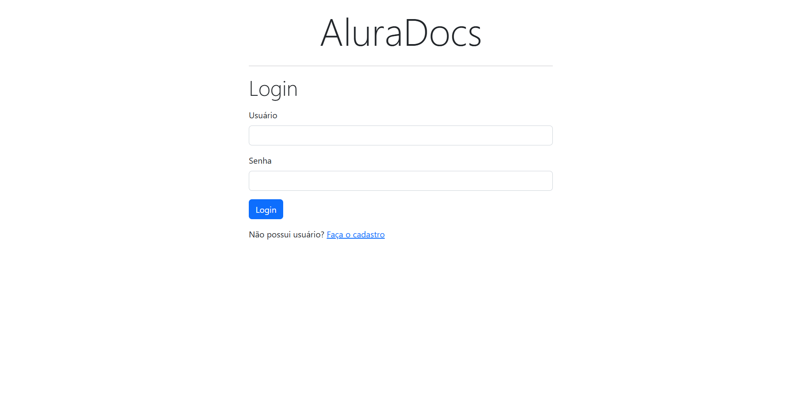
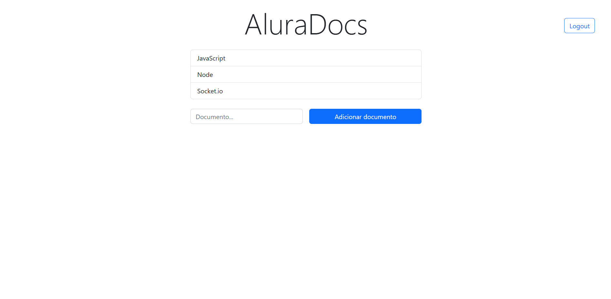

<h1>Alura Docs - WebSockets</h1>

<h2>🔖 Sobre</h2>

Projeto AluraDocs com cadastro, login e autenticação Jwt, usando WebSockets com MongoDB, criado durante a formação de APIs com Node.js e Express  📚

O projeto consiste em documentos de texto que podem ser criados e alterados em tempo real por várias pessoas graças ao WebSockets

<h2> 🚀 Tecnologias </h2>

  
  
  

<h2> 🖥️ Páginas do projeto </h2>

<h3> Login 🖱️ </h3>

<h3> Documentos 📄 </h3>
